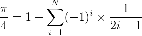

# Calculating Pi (π)

Implementation of how to calculate the value of π with Python.

## Polygon to approximate a cercle

The first and most obvious way to calculate Pi (π) is to take the most perfect circle you can, and then measure its circumference and diameter to work out Pi (π).

  

  

## Monte Carlo

The idea is to simulate random (x, y) points in a 2-D plane with domain as a square of side 1 unit. Imagine a circle inside the same domain with same diameter and inscribed into the square. We then calculate the ratio of number points that lied inside the circle and total number of generated points. The beauty of this algorithm is that we don’t need any graphics or simulation to display the generated points. We simply generate random (x, y) pairs and then check if  x² + y² < 1 . If yes, we increment the number of points that appears inside the circle. In randomized and simulation algorithms like Monte Carlo, the more the number of iterations, the more accurate the result is. 

  

  

## Gregory-Leibniz Series

One of the most well known and beautiful ways to calculate Pi (π) is to use the Gregory-Leibniz Series:

  

  

## Nilakantha Series

Another series which converges more quickly is the Nilakantha Series which was developed in the 15th century. Converges more quickly means that you need to work out fewer terms for your answer to become closer to Pi (π) :

  

  

## References

[Calculating pi](http://www.mathscareers.org.uk/article/calculating-pi/)

[How to Calculate Pi](https://www.wikihow.com/Calculate-Pi)

[Estimating Pi Monte Carlo](https://www.geeksforgeeks.org/estimating-value-pi-using-monte-carlo/)

## LICENSE
MIT

